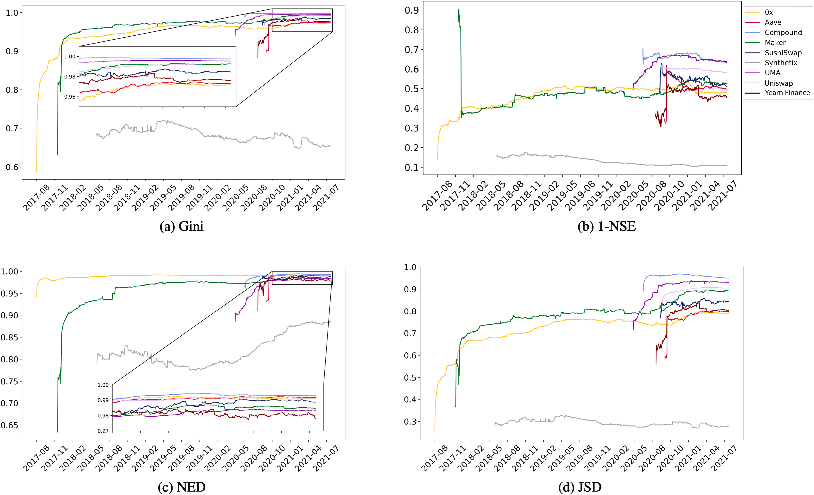

# DAOs - Tier 1
You’re a DeFi enthusiast who spends a lot of time participating in and analyzing DAOs, their governance contracts, and their overall level of participation. Over the past couple of years, the market has slowed down and you’ve begun to notice that some DAOs are not the same as they used to be.

- a) Identify a set of DAOs that are most vulnerable to an economic governance attack, describe how it may be achieved, and estimate the cost to the attacker.

Economic governance attacks occur when an attacker acquires sufficient voting power to exceed the intended limits of the governance process, such as by single-handedly proposing and passing a proposal within a DAO. A recent example of this occurred on the Compound platform, where an attacker gamed the governance system to receive a total compensation of 500,000 COMP tokens (worth $22.5M).

A governance attack typically involves purchasing or gaining access to enough voting power to execute an unintended proposal. DAOs most susceptible to economic governance attacks are those with a high ratio of extractable value to the total cost of acquiring the required share of votes.

The cost of purchasing votes depends on multiple factors, with some of the most important being vote concentration, total token capitalization, and average proposal participation. For instance, if a DAO has a market cap of $100M, but only an average of 10% of voters participate in each proposal, an attacker might only need to purchase 5% of the tokens in circulation (or $5M) to successfully execute the attack.

Using vote concentration and decentralization as key factors to determine vulnerability to an attack, we can identify three DAOs that stand out as centralized based on [the following research paper on decentralization metrics](https://www.sciencedirect.com/science/article/pii/S0160791X23000568#fig6):

- UMA
- Compound
- Uniswap

Estimating the total cost to perform an attack on the above DAOs is complex. An attack could involve not only purchasing tokens to vote but also acquiring voting power by convincing a centralized entity, such as an exchange or market maker, to suddenly delegate their votes.

For some rough calculations, we can use the last governance attack on Compound as a reference. Assuming all votes were bought, we can estimate a total capital requirement of 400,000 COMP (worth $17.6M at current prices). The total cost should include trading fees to acquire that capital, token depreciation after the attack, and opportunity cost during accumulation. Assuming a 10% total cost due to the token's low liquidity, we can estimate the attacker's total cost at $1.7M.

Assuming the relative cost for Uniswap and UMA is proportional to their market cap, we could estimate an attack cost of $22M for Uniswap and $650K for UMA.

- b) For vulnerable DAOs, estimate and describe the potential benefit for the attacker i.e., how much of the DAO’s treasury is at risk of being stolen? (it can also be a parameter change)

For Compound, we'll consider the total potential value at risk to be their total TVL, given their upgradeable contracts or parameters.

For Uniswap, there might be ways to extract money from the TVL (for example, by activating the fee switch), but it's less clear how a governance attack could result in extraction of the users' current TVL.

For UMA, we found no significant risks to their TVL associated with a potential governance attack.

1. Compound:
- Treasury at risk: $84.56M (DefiLlama)
- TVL at risk: $1.954B (DefiLlama)
2. Uniswap:
- Treasury at risk: $2.38B
- TVL at risk: $0
3. UMA:
- Treasury at risk: $76.79M (Token Terminal)
- TVL at risk: $37.14M (DeFiLlama)

