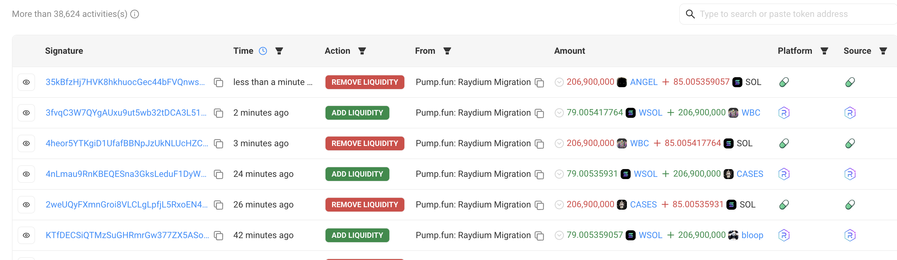
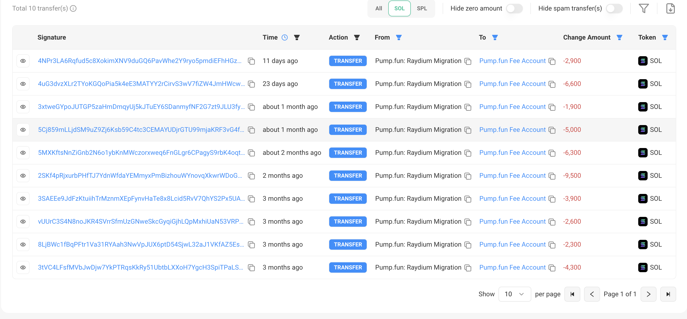
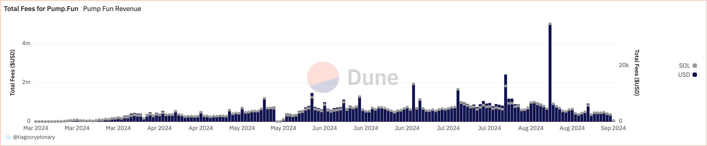

# Pump-It - Tier 2
You notice the growing attention around pump.fun and can't help but take a deeper look. You are interested in their revenue sources and observe that they take fees for a few distinct actions.


### a) How much revenue did Pump generate and can you decompose this for each action? E.g. [pump.fun](http://Pump.Fun) takes fees for each trade on the bonding curve, so one revenue component would be the sum of all “trades via the bonding curve” (the distinct action).

Fees from trading go to [this address](https://solscan.io/account/CebN5WGQ4jvEPvsVU4EoHEpgzq1VV7AbicfhtW4xC9iM), which currently holds 308,151.8 SOL($40,971,863.57) and $38.8M USDC. Fees are collected in sol, but the account [sold part of their treasury](https://solscan.io/tx/4rebhjk89XHw8vxfM6c9sRn2vgE9htPueHMiwJtS6a4oHKP7XVJRVx2CjVXddEaQ3RwHQWw9Mgz5pETmM4kk4jV3) to USDC. [This query](https://dune.com/queries/3994714/6723544/) tracks the value of this fee account incrementally by transactions, to track the revenue per day. Using this methodology the estimated total revenue is calculated at is **679,947 SOL**, or  **$101,650,360**. 

Pump fun has two different sources of revenue: 
1. **Migration fees**: Whenever a pool reaches a market cap of $69k, the liquidity is migrated to Raydium, using [this account]https://solscan.io/account/39azUYFWPz3VHgKCf3VChUwbpURdCHRxjWVowf5jUJjg#defiactivities



The revenue is made by taking a cut to the total amount of SOL liquidity which is stored in the bonding curve. To find how much revenue was made using migration fees, we can filter the transactions made from the migration account to the fee account, getting a total revenue of:



`>>> 2900 + 6600 + 1900 + 5000 + 6300 + 9500 + 3900 + 2600 + 2300 + 4300 + 2230 (curr balance) = 47530 SOL`

So the total amount found using this approach was 45300 SOL ($6.35M at current prices)


1. **Bounding curve swap fees**: A 1% fee that is charged to every user who trades on the bonding curve. 



Given that we didn't find any other fee, we can assume the rest of the revenue cam from bonding curve swap fees: 

`679947 - 47530 = 632417 SOL`
 
### b) What percentage of tokens were successfully deployed to Raydium? Find the tokens that:

We will be using this query as inspiration to do the above calculations

- Took the most time to deploy to Raydium.
- Took the least amount of time to deploy to Raydium.

    1. Get total mints, with minting time


    https://dune.com/queries/4044829/6810573/5d5fe30a-ed3d-4bd0-b9f1-8c8e9791076f

    ```sql
    WITH minted_tokens AS (
  -- Get the first minting time for each token
  SELECT
    account_arguments[1] AS token_address,
    MIN(block_date) AS minting_time
  FROM solana.instruction_calls
  WHERE
    executing_account = '6EF8rrecthR5Dkzon8Nwu78hRvfCKubJ14M5uBEwF6P'
    AND BYTEARRAY_SUBSTRING(data, 1, 8) = FROM_HEX('181ec828051c0777') /* global:create sha256 first 8 byte */
    AND tx_success = TRUE
  GROUP BY
    account_arguments[1]
    )
    -- View the minted tokens and their minting time
    SELECT *
    FROM minted_tokens
    ORDER BY minting_time ASC
    LIMIT 10
    ;
  ```

2. Get total migrations, with time:

    ```sql
    WITH launched_tokens AS (
    -- Get the first launch to Raydium time for each token
    SELECT
        account_arguments[3] AS token_address,
        MIN(block_date) AS launch_time
    FROM solana.instruction_calls
    WHERE
        executing_account = '6EF8rrecthR5Dkzon8Nwu78hRvfCKubJ14M5uBEwF6P'
        AND BYTEARRAY_SUBSTRING(data, 1, 8) = FROM_HEX('b712469c946da122') /* global:withdraw sha256 first 8 byte */
        AND tx_success = TRUE
    GROUP BY
        account_arguments[3]
    )
    -- View the launched tokens and their launch time
    SELECT *
    FROM launched_tokens
    ORDER BY launch_time ASC
    LIMIT 10;
    ```

https://dune.com/queries/4044844/6810594/b4755620-66ff-40d6-beb3-09d6a0364f58

3. Get the above requirements

Now, we can just run this query to finally estimate:


The 10 tokens who took the most to graduate:

```sql

mint_to_launch_time AS (
  -- Combine minting and launching times, and calculate the time difference
  SELECT
    minted_tokens.token_address,
    minted_tokens.minting_time,
    launched_tokens.launch_time,
    DATE_DIFF('day', minted_tokens.minting_time, launched_tokens.launch_time) AS days_to_graduate
  FROM
    minted_tokens
  JOIN
    launched_tokens
  ON minted_tokens.token_address = launched_tokens.token_address
)
-- Rank tokens by the time it took to launch after minting
SELECT
  token_address,
  minting_time,
  launch_time,
  days_to_graduate
FROM mint_to_launch_time
ORDER BY days_to_graduate DESC
LIMIT 10;
```

The results can be seen here:
https://dune.com/queries/4044857/6810609/53329df1-0b8d-4653-8ba1-54389ebcdc23

The token who took the most is C1zbYRGs2kXKxuFxf1Nb4VrXy2x6e1bYpVUxLDBgiwgk (LFG), minted at 2024-01-18 00:00 who took 211 to graduate

And now we will od the opposite, show the ones who took the least amount of time, with the results here:

https://dune.com/queries/4044860/6810614/bc9becf8-53a2-4060-82fa-cd457b6f6d85


### c) Using the information gained from the above sub-questions about fee generation, were there any cases where the pump team had a clear incentive to buy any given token created through their platform? If yes, provide an example. If no, explain the conditions under which this incentive would exist.

The team has an incentive to buy (pump) the price when the market cap approaches the migration market cap (currently 69k) to ensure they receive the migration fees. For example, a token might eventually require only a $1 purchase in the bonding curve to migrate. In this case, the team would be strongly motivated to spend that $1 to secure the entire migration fee.
