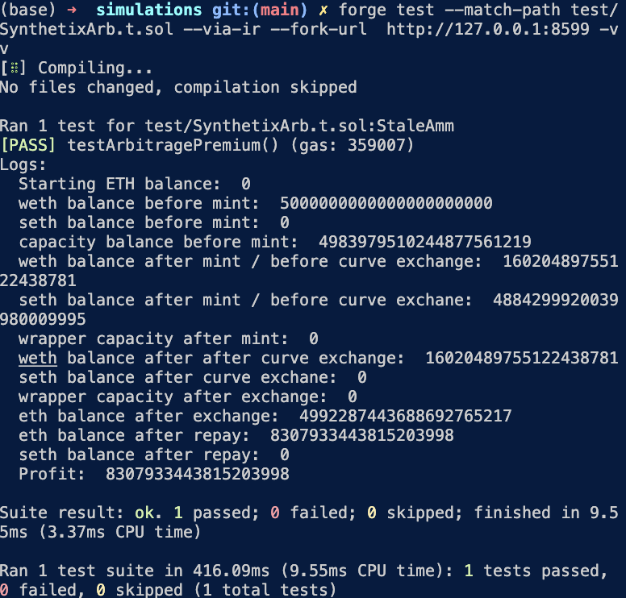

# Long-Tail-Enjoyor - Tier 3
You’re an active member of the Synthetix community and noticed that the implementation of one of [their latest SIPs](https://sips.synthetix.io/sips/sip-112/) will be deployed today (May 13, 2021).

- a) How, in theory, can you make money based on the SIP specification?
    You can either:
     - mint sETH 1:1 with weth and sell it on the secondary markets when price is above peg, or
     - Buy it at a discount on secondary markets and sell it to this contract when it is trading below peg on secondary markets.
- b) Provide the simulation data when you execute the opportunity using the full `maxETH` amount. 
    Assuming we created a bot we would have profited 8.3 ETH, as an opportunity was available for 306 blocks, since block `12427801` to block `12428106`, when [a bot finally took the full capacity of the wrapper](https://etherscan.io/tx/0x81f1dce97821f86198333eb67577cb2d931e49092dbb0f67e3c391e1574e091)

    
    It can be found attached an example doing an arbitrage on block `12428106`, the same day the wrapper was deployed where it was actually possible to use `maxEth` to arb the pool, making a *profit of > 8.3 ETH*. 

    The steps that we made in our test were the following

    1. Get acceess to a large amount of ETH. We could have made it by doing a flashloan on dydx or aave [like this bot](https://etherscan.io/tx/0x81f1dce97821f86198333eb67577cb2d931e49092dbb0f67e3c391e1574e091 but to simplify the PoC we will just `mint` ourselves 5000 ETH
     
    2. Call the Synthetix wrapper to mint the max amount of ETH `synthetixWrapper.mint(maxEth);`

    3. In exchange we receive `seth` 1:1

    4. Sell `seth` on Curve pool, at a premium, receive 8.3044615 ETH profit

    5. Repay loan

